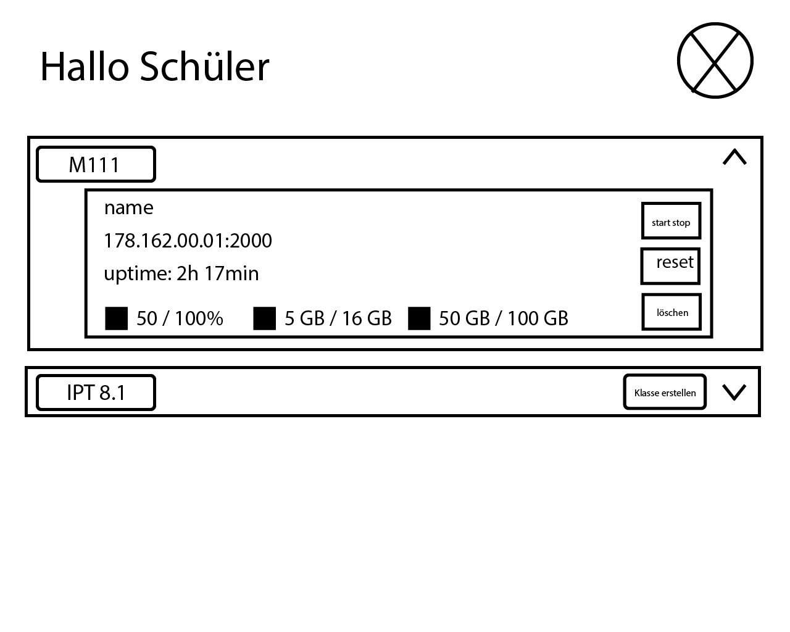
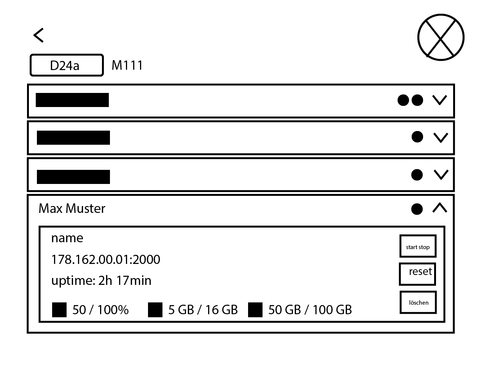
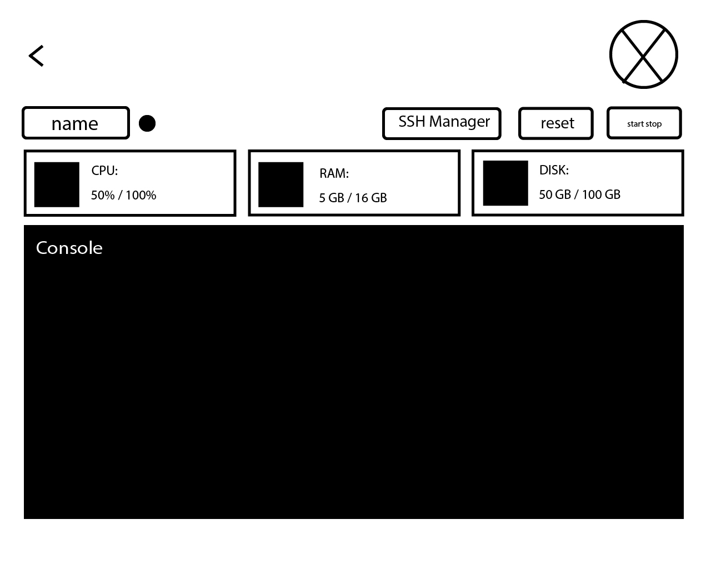

# Team ExoFace
## Dokumentinformationen

| Feld | Wert |
|---|---|
| **Projektname** | Frontend für Cloud-Computer |
| **Projekt** | Exoface |
| **Auftraggeber** | Lagger Stefan |
| **Datum** | 26.08.2026 |

---

# 1. Einleitung

## 1.1 Zweck des Projekts

Das Projekt umfasst die Entwicklung eines Frontends zur Verwaltung von VM's für die schulische Nutzung. Das Frontend dient als Kontroll-Panel, über das Lehrer und Schüler ihre VM's verwalten können.

Die Anwendung soll die Verwaltung von Lernenden, Klassen und deren VM's vereinfachen und eine Schnittstelle zur Exoscale-API bereitstellen.

## 1.2 Muss-Ziele

- Das System verfügt über zwei Rollen: Lehrer und Schüler.
- Lehrpersonen können Lernende über einen Schulnetz-Export erfassen.
- Lehrpersonen können einzelne Lernende verwalten.
- Lehrpersonen können VMs für ganze Klassen erstellen und löschen.
- Schüler können ihre eigene VM zurücksetzen.
- Lehrpersonen und Schüler können ihre VM starten und stoppen.
- VMs werden nach Fach gruppiert angezeigt.
- Die Zuordnung zu einem Fach erfolgt über ein Label bei der jeweiligen VM.
- Das System verfügt über Logging.
- Das System verfügt über Error-Handling.
- Notwendige CRUD-Operationen werden unterstützt.
- Das Frontend verfügt über eine Schnittstelle zur Exoscale-API.

## 1.3 Kann-Ziele

- Generierung von SSH-Keys direkt über das Web- bzw. Frontend-Interface.
- Ein direktes Bash-/PowerShell-Terminal im Frontend.

---

# 2. Systemübersicht

## 2.1 Projektbeschreibung

Das System ist ein Kontroll-Panel für die Verwaltung von VMs im schulischen Umfeld.

Lehrpersonen sollen Lernende aus einem Schulnetz-Export erfassen und VMs für ganze Klassen verwalten können. Schüler erhalten Zugriff auf ihre eigene VM und können diese starten, stoppen, zurücksetzen und einen SSH-Key hinterlegen.

Die VMs werden nach Fach gruppiert dargestellt. Für die Zuordnung wird bei einer VM ein Label verwendet.

## 2.2 Systemkontext

### Beteiligte Rollen

| Rolle | Beschreibung |
|---|---|
| **Lehrer** | Verwaltet Lernende, Klassen und die zugehörigen VMs. |
| **Schüler** | Verwaltet die eigene VM und deren Zugriff. |

# 3. Funktionale Anforderungen

## 3.1 Übersicht

| ID | Anforderung | Priorität |
|---|---|---|
| **F001** | Benutzer können VMs starten und stoppen. | Muss |
| **F002** | Lehrpersonen können Lernende über einen Schulnetz-Export erfassen. | Muss |
| **F003** | Lehrpersonen können VMs für ganze Klassen erstellen. | Muss |
| **F004** | Lehrpersonen können VMs für ganze Klassen löschen. | Muss |
| **F005** |  Schüler können ihre eigene VM zurücksetzen. | Muss |
| **F006** |  Schüler können einen SSH-Key bei ihrer VM hinterlegen. | Muss |
| **F007** | VMs werden nach Fach gruppiert angezeigt. | Muss |
| **F008** | Das System stellt eine Schnittstelle zur Exoscale-API bereit. | Muss |
| **F009** | SSH-Keys können direkt über das Frontend generiert werden. | Kann |
| **F011** | Bash-/PowerShell-Terminal direkt im Frontend. | Kann |
| **F012** | Registration & Schülerverwaltung | Muss |

## 3.2 F001 – VMs starten und stoppen

**Beschreibung**

Lehrpersonen und  Schüler können die ihnen zugeordneten VMs starten und stoppen.

**Akzeptanzkriterien**

- Eine berechtigte Person kann eine VM starten.
- Eine berechtigte Person kann eine VM stoppen.
- Der aktuelle Zustand der VM wird im Frontend entsprechend dargestellt.

## 3.3 F002 – Lernende über Schulnetz-Export erfassen

**Beschreibung**

Lehrpersonen können Lernende über einen Export des Schulnetzes in das System importieren.

**Akzeptanzkriterien**

- Ein Schulnetz-Export kann zur Erfassung von Lernenden verwendet werden.
- Die importierten Lernenden stehen anschliessend im System zur weiteren Verwaltung zur Verfügung.

## 3.4 F003 – VMs für ganze Klassen erstellen

**Beschreibung**

Lehrpersonen können VMs für eine ganze Klasse erstellen.

**Akzeptanzkriterien**

- Eine Lehrperson kann eine Klasse auswählen.
- Für die Lernenden der ausgewählten Klasse können VMs erstellt werden.

## 3.5 F004 – VMs für ganze Klassen löschen

**Beschreibung**

Lehrpersonen können die VMs einer ganzen Klasse löschen.

**Akzeptanzkriterien**

- Eine Lehrperson kann eine Klasse auswählen.
- Die zugehörigen VMs können gelöscht werden.

## 3.6 F005 – Eigene VM zurücksetzen

**Beschreibung**

 Schüler können ihre eigene VM zurücksetzen.

**Akzeptanzkriterien**

-  Schüler können die Reset-Funktion ihrer eigenen VM auslösen.
- Die Reset-Funktion ist nicht als allgemeine Funktion für fremde VMs vorgesehen.

## 3.7 F006 – SSH-Key hinterlegen

**Beschreibung**

 Schüler können einen SSH-Key bei ihrer eigenen VM hinterlegen.

**Akzeptanzkriterien**

- Ein Schüler kann einen SSH-Key für seine eigene VM hinterlegen.
- Die Zuordnung des SSH-Keys zur VM wird im System gespeichert bzw. an die dafür vorgesehene Schnittstelle weitergegeben.

## 3.8 F007 – VMs nach Fach gruppieren

**Beschreibung**

Die VMs werden im Frontend nach Fach gruppiert dargestellt.

**Akzeptanzkriterien**

- VMs werden im Frontend nach dem zugehörigen Fach gruppiert angezeigt.
- Die Gruppierung ist anhand der VM-Zuordnung nachvollziehbar.
- Fach ist Via Label dargestellt

## 3.10 F008 – Exoscale-API

**Beschreibung**

Das System kommuniziert zur Verwaltung der VMs mit der Exoscale-API.

**Akzeptanzkriterien**

- Das System kann die für die VM-Verwaltung benötigten Funktionen über die Exoscale-Schnittstelle ansprechen.
- Fehler bei der Kommunikation mit der Schnittstelle werden behandelt und protokolliert.

## 3.11 F009 – SSH-Key-Generierung

**Beschreibung**

Optional soll die Möglichkeit bestehen, SSH-Keys direkt über das Website-/Frontend-Interface zu generieren.

**Akzeptanzkriterien**

- Die generation Funktioniert korrekt und kryptographisch sichere Schlüssel werden dem Nutzer bereitgestellt. 

## 3.12 F010 – Bash-/PowerShell-Terminal

**Beschreibung**

Optional soll ein Bash- bzw. PowerShell-Terminal direkt im Frontend zur Verfügung gestellt werden.

**Akzeptanzkriterien**

- Nutzer kann sich per Exoscale API über eine Websocket mit einer Bash / Powershell Instanz verbinden

## 3.10 F0011 – Registration & Schülerverwaltung

**Beschreibung**

Bei Erstellung von Nutzer-Account befindet sich der Account in einem provisorischen State. Wenn Nutzer auf Exoface zugreifen möchte, muss er zuerst den On-Boarding Prozess abschliessen. Dieser Prozess besteht aus einer E-Mail, welche der Nutzer erhält wenn ein Lehrer ihn zum 1. provisorisch im System registriert. Nach klicken auf URL in E-Mail, Nutzer sind dazu aufgefordert ein eigenes Passwort zu setzen und evtl. noch andere Details anzugeben.
Lehrer können Schüler Accounts provisorisch erstellen, löschen und bearbeiten.

**Akzeptanzkriterien**

- Nutzer erhält E-mail mit On-Boarding Instructions.
- Nach On-Boarding mit Passwortsetzung, wird der Account freigegeben fürs Login.
- Lehrer können Schüler Accounts provisorisch erstellen, löschen und bearbeiten.

---

# 4. Nichtfunktionale Anforderungen

## 4.1 Übersicht

| ID        | Anforderung                                                             | Priorität |
| --------- | ----------------------------------------------------------------------- | --------- |
| **NF001** | Logging der relevanten Systemvorgänge und Fehler.                       | Muss      |
| **NF002** | Fehlerbehandlung bei fehlerhaften Vorgängen und Schnittstellenaufrufen. | Muss      |

## 4.2 NF001 – Performance

**Beschreibung**

Nutzererfahrung wird nicht beinträchtigt durch Laufzeitdauer von z.B. Datenbankquerries oder API requests ans Backend.  

**Akzeptanzkriterien**

- Keine Ladedauer über 2 Sekunden bei Requests an unser Backend.

## 4.3 NF002 – Security

**Beschreibung**

Sensible Daten müssen alle verschlüsselt sein in der Datenbank, nach mehreren falschen Loginversuchen gibt es ein Login time-out

**Akzeptanzkriterien**

- Fehler führen nicht zu einem unkontrollierten Abbruch der Anwendung.
- Benutzer erhalten bei fehlgeschlagenen Vorgängen eine geeignete Rückmeldung.

---

# 5. Benutzeroberfläche

## 5.1 Wireframes / Mockups

Mockup: https://github.com/McBenjihood/Team-Exoface/tree/main/Mockup

---

# 6. Projektplanung

## 6.1 Meilensteine

| Meilenstein             | Termin |
| ----------------------- | ------ |
| Analyse abgeschlossen   | 09.09.26|
| Sprint 1   | 14.10.26|
| Sprint 2   | 18.11.26|
| Umsetzung abgeschlossen | 16.12.26|
| Test abgeschlossen      | 13.01.27|
| Sprint 3   | 13.01.27|
| Abnahme                 | 20.01.27|

